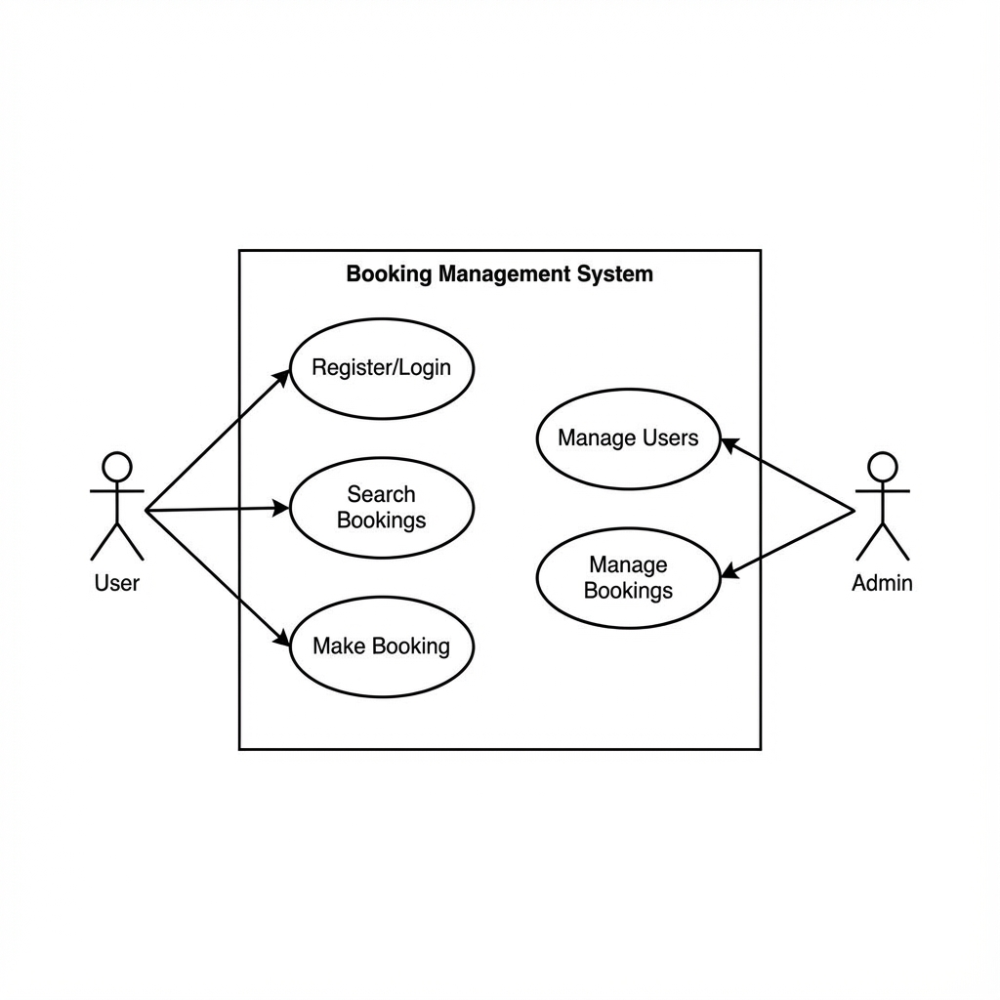

# Requirement Analysis in Software Development

The Requirement Analysis Project focuses on crafting a comprehensive foundation for software development by documenting, analyzing, and structuring requirements. This repository contains the detailed blueprint for the requirement analysis phase of a booking management system, simulating a real-world development scenario to emphasize clarity, precision, and structure in software engineering.

## What is Requirement Analysis?

Requirement Analysis is the process of determining user expectations for a new or modified product. These features, called requirements, must be quantifiable, relevant, and detailed. In software engineering, it is a critical phase that involves identifying, documenting, and managing the needs and constraints of stakeholders to ensure the final software product aligns with their goals.

## Why is Requirement Analysis Important?

Requirement Analysis is a critical phase in the Software Development Lifecycle (SDLC) for several key reasons:

1.  **Ensures Stakeholder Alignment:** It ensures that todos, developers, and users have a shared understanding of the project's goals. This reduces the risk of project failure due to misunderstood expectations.
2.  **Prevents Scope Creep:** By clearly defining the project's boundaries at the start, it helps manage what is (and isn't) included in the project, preventing uncontrolled growth of requirements.
3.  **Reduces Development Costs and Time:** Identifying and fixing requirement-related issues during the analysis phase is significantly cheaper and faster than making changes after development has started.
4.  **Improves Software Quality:** It establishes the baseline for testing and quality assurance, ensuring that the final product meets the defined needs and functions as intended.
5.  **Provides a Foundation for Design:** Clear requirements serve as a detailed blueprint for architects and developers to build a robust technical solution.

## Key Activities in Requirement Analysis

To ensure a thorough understanding of the project's needs, several key activities are performed during the analysis phase:

*   **Requirement Gathering:** The initial phase where developers and analysts interact with stakeholders to collect their needs and expectations for the system.
*   **Requirement Elicitation:** A deeper dive into the gathered information to uncover hidden requirements, resolve conflicts, and refine the stakeholders' initial requests through interviews, surveys, and workshops.
*   **Requirement Documentation:** The process of formalizing the gathered and elicited requirements into a structured document (like a Software Requirements Specification) that serves as the "single source of truth."
*   **Requirement Analysis and Modeling:** Analyzing the documented requirements to identify gaps, inconsistencies, or ambiguities. This often involves creating visual models like Flowcharts, Data Flow Diagrams, or Use Case Diagrams.
*   **Requirement Validation:** The final check to ensure that the documented requirements accurately reflect the stakeholders' needs and are feasible to implement.

## Types of Requirements

Requirements are generally categorized into two main types: Functional and Non-functional.

### Functional Requirements
Functional requirements define the specific behaviors, tasks, or functions the system must perform. They describe *what* the system does.

**Examples for the Booking Management System:**
*   **User Registration:** The system shall allow users to create an account using their email and a secure password.
*   **Search Functionality:** Users must be able to search for available bookings based on date, location, and price range.
*   **Booking Confirmation:** The system shall automatically send a confirmation email to the user once a booking is successfully completed.

### Non-functional Requirements
Non-functional requirements define the system's quality attributes, constraints, and performance goals. They describe *how* the system performs its functions.

**Examples for the Booking Management System:**
*   **Performance:** The system should display search results within 2 seconds of the user submitting their query.
*   **Security:** All user payment information must be encrypted using industry-standard protocols (e.g., SSL/TLS).
*   **Scalability:** The platform must be capable of handling at least 1,000 concurrent users without degradation in performance.

## Use Case Diagrams

Use Case Diagrams are visual representations of the interactions between users (actors) and a system. They provide a high-level view of the system's functionality and are essential for:
*   **Identifying Stakeholders:** Clearly defining who will interact with the system.
*   **Defining System Scope:** Outlining what the system will and will not do.
*   **Facilitating Communication:** Providing a simple, non-technical visual that both developers and stakeholders can understand.

Below is the Use Case Diagram for the ALX Booking Management System:

## Acceptance Criteria

Acceptance Criteria are the specific conditions that a software product must meet to be accepted by a user, customer, or other stakeholder. They are critical because they:
*   **Reduce Ambiguity:** Clearly define what "done" looks like for a particular feature.
*   **Guide Development:** Provide developers with a clear target to aim for.
*   **Provide a Basis for Testing:** Form the foundation for creating test cases to verify the system works as expected.

### Example: Checkout Feature Acceptance Criteria

**Feature:** User Checkout (Booking Management System)

1.  **Payment Validation:** The system must verify that the payment information (credit card number, expiry, CVV) is valid before processing the transaction.
2.  **Booking Availability:** The system must re-verify that the selected slot/room is still available before finalizing the payment.
3.  **Confirmation Generation:** Upon successful payment, the system must generate a unique booking reference ID and display it to the user.
4.  **Notification:** A confirmation email containing the booking details and receipt must be sent to the user within 60 seconds of a successful transaction.
5.  **Error Handling:** If the payment fails, the system must display a clear error message to the user and allow them to re-enter their details or choose a different payment method.